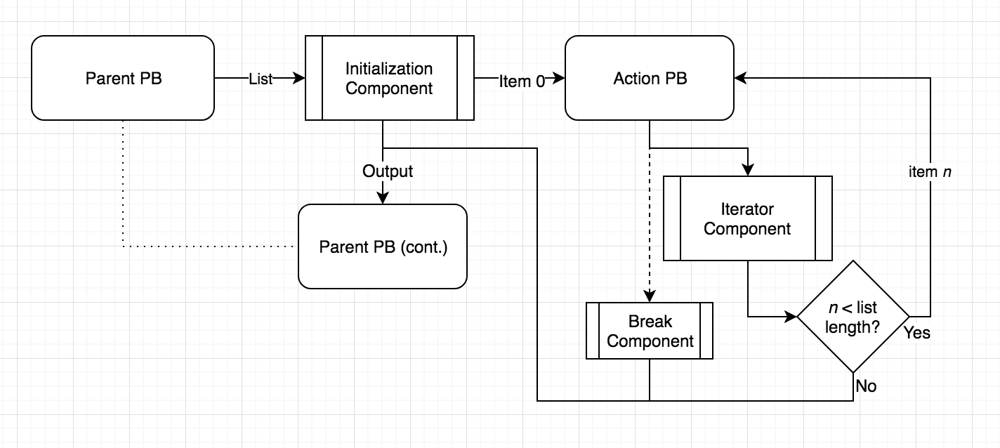
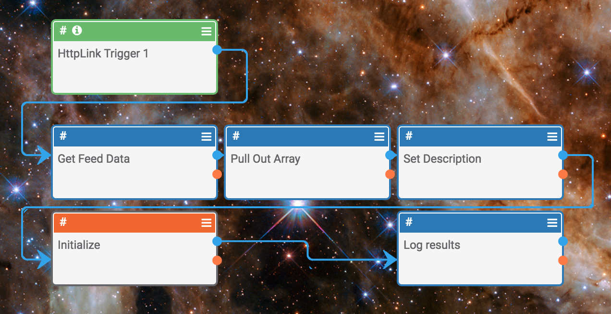
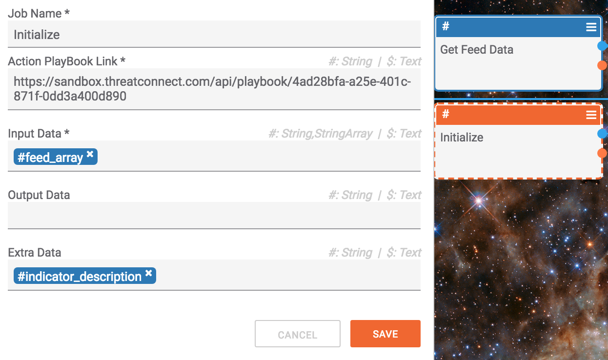
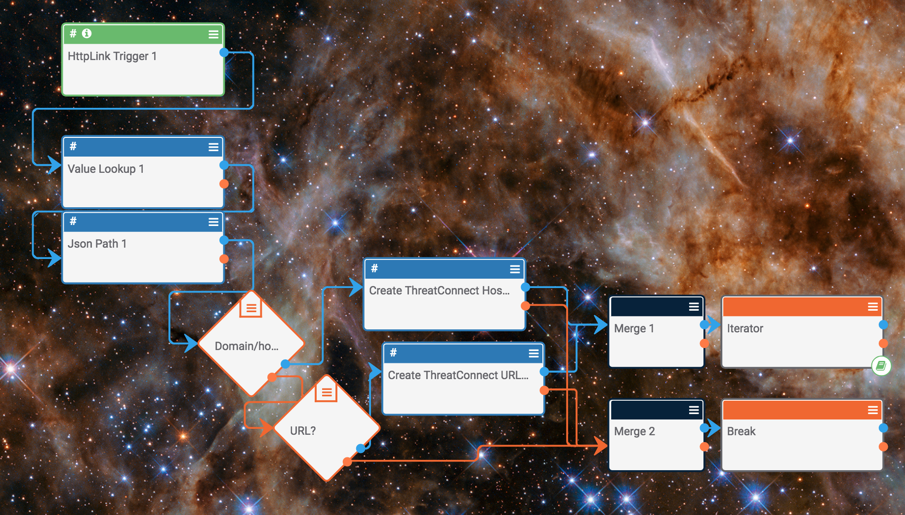
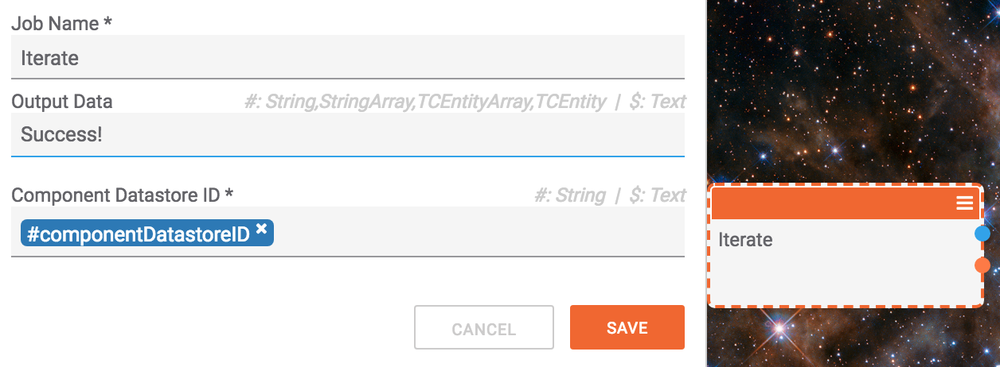
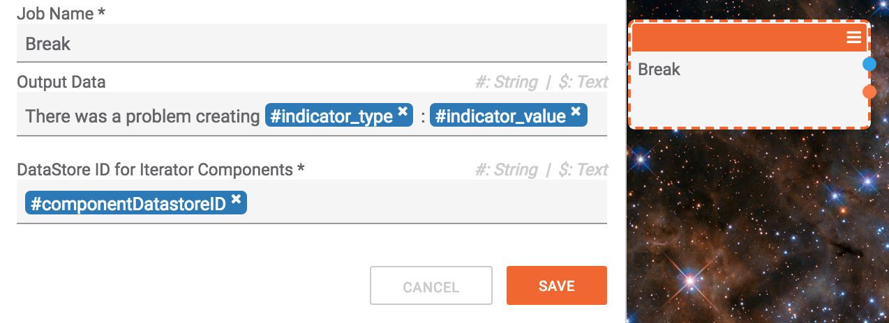
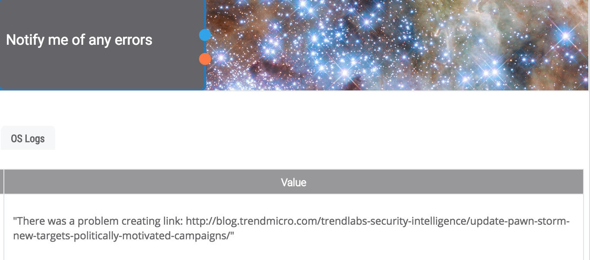

# List Iteration

Iterating through lists in playbooks (just like a basic iterator in programming) involves 3 main components:

    1. Initialization
    2. Iterator
    3. (optional) Break



We begin with a parent playbook that collects or builds some list. We then have an _action_ playbook that takes each item in the list as input. We pass the list and the url of the action playbook to the initialization component. In the action playbook we have a component to keep iterating through the list until the end of the list is reached. Optionally, the user can use the break component to exit the loop earlier if so desired. Pretty simple!

## Example Use Case

Let us begin with a basic use case. Say your boss assigns you the task of building a system to process a new intel feed and extract indicators for your organization. Let us also assume you wish to stay away from programming. Lucky for you, our iterator method in playbooks has made such a task quite trivial.


### The Data
```json
{
    "Event": {
        "info": "Update on Pawn Storm: New Targets and Politically Motivated Campaigns",
        "publish_timestamp": "1515851051",
        "timestamp": "1515850537",
        "analysis": "2",
        "Attribute": [{
            "comment": "",
            "category": "Network activity",
            "uuid": "5a5a0b04-198c-4190-9f1a-8d1cc0a8ab16",
            "timestamp": "1515850500",
            "to_ids": true,
            "value": "adfs.senate.group",
            "object_relation": null,
            "type": "hostname"
        }, {
            "comment": "",
            "category": "Network activity",
            "uuid": "5a5a0b04-4d44-463f-81a9-8d1cc0a8ab16",
            "timestamp": "1515850500",
            "to_ids": true,
            "value": "adfs-senate.email",
            "object_relation": null,
            "type": "domain"
        }
        //so on and so forth...
        ]
    }
}
```

Looking at the data feed, we see that it makes sense to iterate throught the `Attribute` list and create the appropriate indicators in ThreatConnect. We probably also want to add a short description to each one as well. Additionally, if we encounter an issue with a particular indicator, we want to stop the process and log the error.

## The Solution

Lets start with the parent playbook as such:



After fetching the data feed using an http client and pulling out the desired array `Attribute`, we set a description to be applied to each indicator and call the iterator initialization component like so...



The iterator initialization takes 4 input, some of which are optional:

1. **Extra Data** (optional) - This field is meant to store some arbitrary data to be passed down to the action playbook. In this case it is being used to pass the description we would like to see applied to each indicator. However, this can become more useful if you are passing in json structs. More on that later...
2. **Action PlayBook Link** - The action playbook which will be executed on each of the items in the list.
3. **Output Data** (optional) - Any output data we would like to pre-set. This can be useful when you want to append some results over each iteration and have some initial value. Again, lets not worry about these features for now.
4. **Input Array** - The array we would like to iterate through.

So far so good. Lets take a look at the action playbook doing the real work...



Nothing too complicated going on here but just make note of the things we are pulling out of the http link trigger:

- (_header_) **extra_data:** The indicator description in our case
- (_header_) **ds_id:** A unique DataStore ID that is required to be passed down to the iterator component (generated by initialization)
- (_body_) **item:** The current item in the list that the iterator has pointed us to

We are simply pulling out the _type_ and _value_ out of the json item passed in and creating the appropriate indicators. If there is an error we use the break component to exit the loop, otherwise, the iterator component continues looping through the list.

The configuration for the iterator component is quiet simple:



We simply pass through the *ds_id* variable extracted from the header of the http link trigger and the output/extra data. Since we are using the same description for each indicator, we pass the extra data as is. We also set the output to a simple success message. The output is eventually returned to the parent playbook.

If something goes wrong, say an indicator fails to create for whatever reason, we wish to break out of the loop and set the result to an informative error message.

For this we have the break component configured as such:


 
Again, pass through the *ds_id* as required by the iterator system and set an error message as the result to be passed back to the parent playbook.

When we run this playbook, all indicators are created until one of them fails (due to being part of the system-wide exclusion list) as such:

